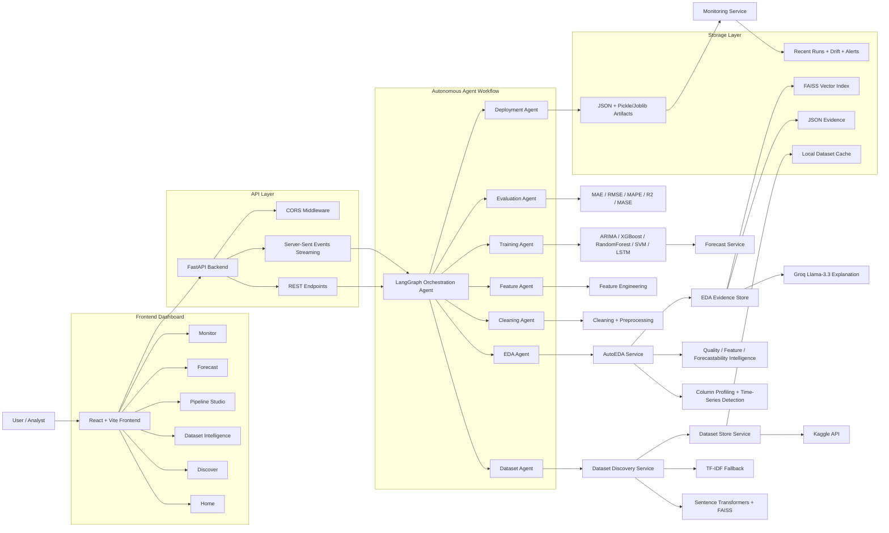

# Chronos AI - Autonomous Time-Series Intelligence System

Chronos AI is an end-to-end autonomous machine learning platform for time-series intelligence. It helps users discover real datasets, run automated EDA, generate dataset intelligence, build adaptive ML pipelines, forecast future values, and monitor model behavior from a single React + FastAPI application.

The system is designed for data scientists, ML engineers, analysts, and operational teams who need reliable forecasting and model evidence without manually wiring every preprocessing, feature engineering, training, and evaluation step.

## Key Capabilities

- Semantic dataset discovery across local cached Kaggle datasets and curated catalog entries.
- Real dataframe loading from local storage or Kaggle references.
- Automated EDA with column profiling, missing-value analysis, time-series detection, target recommendation, forecastability scoring, quality intelligence, feature intelligence, and visualization planning.
- Evidence-gated AI explanation using persisted EDA JSON and FAISS vector evidence.
- Adaptive model selection across `ARIMA`, `XGBoost`, `RandomForest`, `SVM`, and `LSTM`.
- Full training pipeline with cleaning, feature engineering, validation, evaluation metrics, deployment metadata, and local artifact export.
- Forecast dashboard with prediction intervals and decision insights.
- Monitoring dashboard with recent runs, model KPIs, drift score, alerts, and system health.
- Server-Sent Events for live EDA and pipeline progress updates.

## Architecture Diagram



## Tool Stack

### Backend

| Area | Tools |
| --- | --- |
| API | FastAPI, Uvicorn, Pydantic |
| Orchestration | LangGraph |
| Data Processing | Pandas, NumPy |
| Machine Learning | Scikit-learn, XGBoost, Statsmodels |
| Semantic Search | Sentence Transformers, FAISS |
| LLM Explanation | Groq Llama-3.3 |
| Dataset Source | Kaggle API, local CSV cache |
| Artifacts | Joblib, JSON metadata |
| Deployment | Docker, Docker Compose |

### Frontend

| Area | Tools |
| --- | --- |
| Framework | React 18, Vite, TypeScript |
| Routing | React Router |
| State | Zustand |
| Charts | Recharts |
| Pipeline Graph | React Flow |
| UI/Animation | Tailwind CSS, Framer Motion, Radix UI, Lucide React |

## Repository Structure

```text
.
├── backend/
│   ├── app/
│   │   ├── agents/
│   │   ├── api/
│   │   ├── core/
│   │   └── services/
│   ├── scripts/
│   ├── storage/
│   │   ├── datasets/
│   │   ├── discovery/
│   │   ├── eda_evidence/
│   │   ├── model_artifacts/
│   │   └── monitoring/
│   ├── Dockerfile
│   ├── docker-compose.yml
│   └── requirements.txt
├── frontend/
│   ├── public/
│   ├── src/
│   │   ├── components/
│   │   ├── data/
│   │   ├── hooks/
│   │   ├── lib/
│   │   ├── pages/
│   │   └── store/
│   ├── package.json
│   └── vite.config.ts
├── PROJECT_REPORT.md
├── project_report.docx
├── md_to_docx.py
└── README.md
```

## Prerequisites

- Python 3.11+
- Node.js 18+ and npm
- Git
- Git LFS
- Kaggle API credentials for live Kaggle dataset loading
- Groq API key for LLM-generated dataset intelligence reports

## Environment Variables

Create `backend/.env` from `backend/.env.example`:

```env
KAGGLE_USERNAME=your_kaggle_username
KAGGLE_API_KEY=your_kaggle_api_key
KAGGLE_KEY=your_kaggle_api_key
GROQ_API_KEY=your_groq_api_key
GROQ_MODEL=llama-3.3-70b-versatile
BACKEND_CORS_ORIGINS=http://localhost:5173,http://127.0.0.1:5173
```

Do not commit real `.env` files.

## Backend Setup

```powershell
cd backend
python -m venv .venv
.\.venv\Scripts\Activate.ps1
pip install -r requirements.txt
uvicorn app.main:app --reload --port 8000
```

Health check:

```text
http://127.0.0.1:8000/api/health
```

## Frontend Setup

Open a new terminal:

```powershell
cd frontend
npm install
npm run dev
```

Frontend URL:

```text
http://localhost:5173
```

The Vite dev server proxies API requests to the FastAPI backend.

## Docker Setup

```powershell
cd backend
docker compose up --build
```

Backend URL:

```text
http://localhost:8000
```

## Main API Endpoints

| Method | Endpoint | Purpose |
| --- | --- | --- |
| `GET` | `/api/health` | Backend health check |
| `POST` | `/api/datasets/search` | Search datasets |
| `GET` | `/api/datasets/{dataset_id}/profile` | Generate dataset profile |
| `GET` | `/api/datasets/{dataset_id}/profile/stream` | Stream EDA progress |
| `GET` | `/api/datasets/{dataset_id}/rows` | Preview raw rows |
| `POST` | `/api/datasets/upload` | Upload and profile CSV |
| `POST` | `/api/pipeline/run` | Run ML pipeline |
| `GET` | `/api/pipeline/run/stream` | Stream pipeline execution |
| `GET` | `/api/forecast/{dataset_id}` | Generate forecast |
| `GET` | `/api/monitor` | Get monitoring snapshot |

## Local Testing Scripts

Run Kaggle discovery smoke test:

```powershell
cd backend
python scripts/smoke_test_kaggle.py
```

Run real dataset EDA and pipeline:

```powershell
cd backend
python scripts/run_real_dataset_pipeline.py --dataset-ref datasetengineer/southern-california-energy-consumption
```

Run local CSV pipeline:

```powershell
cd backend
python scripts/run_real_dataset_pipeline.py --csv-path .\storage\datasets\my_dataset.csv
```

## Git LFS Setup and GitHub Push

This project contains large datasets, model artifacts, FAISS indexes, ZIP archives, and DOCX reports. Use Git LFS for these file types.

```powershell
git init
git lfs install

git lfs track "*.csv"
git lfs track "*.zip"
git lfs track "*.pkl"
git lfs track "*.faiss"
git lfs track "*.docx"
git lfs track "*.safetensors"
git lfs track "*.pt"
git lfs track "*.pth"
git lfs track "*.joblib"

git add .gitattributes
git add .
git commit -m "Initial commit for Chronos AI autonomous time-series intelligence system"

git remote add origin https://github.com/vinaykr8807/Chronos-AI---Autonomous-Time-Series-Intelligence-System.git
git branch -M main
git push -u origin main
```

If the remote already exists:

```powershell
git remote set-url origin https://github.com/vinaykr8807/Chronos-AI---Autonomous-Time-Series-Intelligence-System.git
git push -u origin main
```

## Notes on Large Files

- `frontend/node_modules/` is intentionally ignored and should be recreated with `npm install`.
- `frontend/dist/` is ignored because it is generated by `npm run build`.
- `backend/.env` is ignored because it contains secrets.
- `backend/storage/datasets/`, `backend/storage/eda_evidence/`, and `backend/storage/model_artifacts/` are tracked through Git LFS.

## Report

The detailed project report is available in:

- `PROJECT_REPORT.md`
- `project_report.docx`

## License

This project is intended for academic, research, and demonstration use. Add a formal license file before public production reuse.
